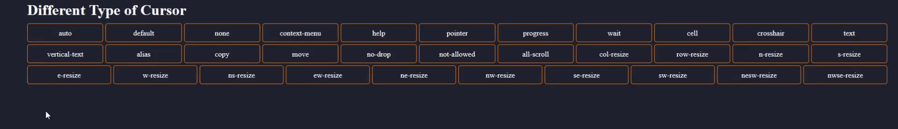

# cursor-type

## Table of contents

-   [General info](#general-info)
-   [Technologies](#technologies)
-   [Preview](#preview)

## General info

This project will help you to understand basic html concept... in this project you will see how to use different cursor type in website !!!

## Technologies

Project is created with:

-   HTML 5
-   CSS 3

## Preview

